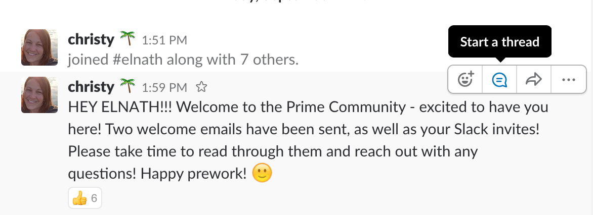
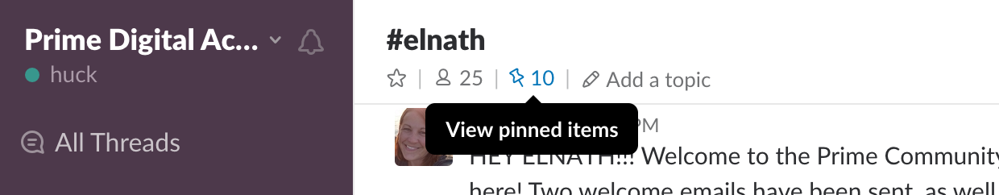
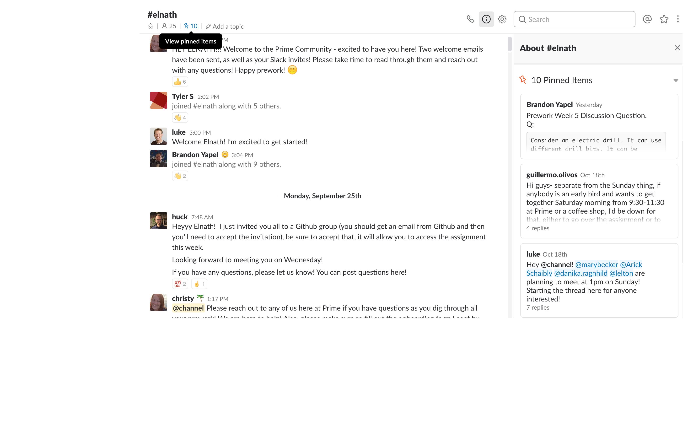

# Slack

## Set up
- First and Last name for usernames  
- profile photo
-Desktop and Phone apps
Slack app:
https://itunes.apple.com/app/slack/id803453959


## Tale of Two Slacks
### On Campus Slack:
https://primeacademycampus.slack.com
### All students and graduates:
- https://primeacademy.slack.com
- Great for networking with Alumni
- Prime has a positive and helpful alumni community. Don't be afraid to reach out!
- \#diveristy-inclusion


## Using Slack

Try to check your cohort channel daily.
There will be updates, announcements, 
You may also have personal messages from Prime staff on Slack. 

Asking for help should be done in the cohort's channel, not directly to instructors or peers. Others will have similar questions.
Instructors will regularly check the Slack channel and answer questions there as well.


have Slack open when working on Prime stuff.

### Threads


### Pinned items




Process for Weekly discussion question

Threading

How to ask questions

### Code Blocks

You can post lines of code or blocks of code in Slack using the backtick ` that is up by the esc key.

a line surrounded by single backticks will look like this: `var subject = 'world'`

For a multi-line code block, start with three back ticks \``` on their own line. Then post the code, and then write a new line with three backticks. 

```
function hello(planet){
   console.log('Hello,', planet);
}
```


### Weekly Discussion
Whoever responds to the discussion question first will make the first post.

Then that post can be pinned to make it easy to find.

Everyone else can reponse to the Weekly Discussion in a thread under the first response. 

How to answer questions
FAQ: Is it okay to post my questions to Slack that may give away answers to other people?

In order to be successful at Prime it is important that everyone approach the hard parts of prog
